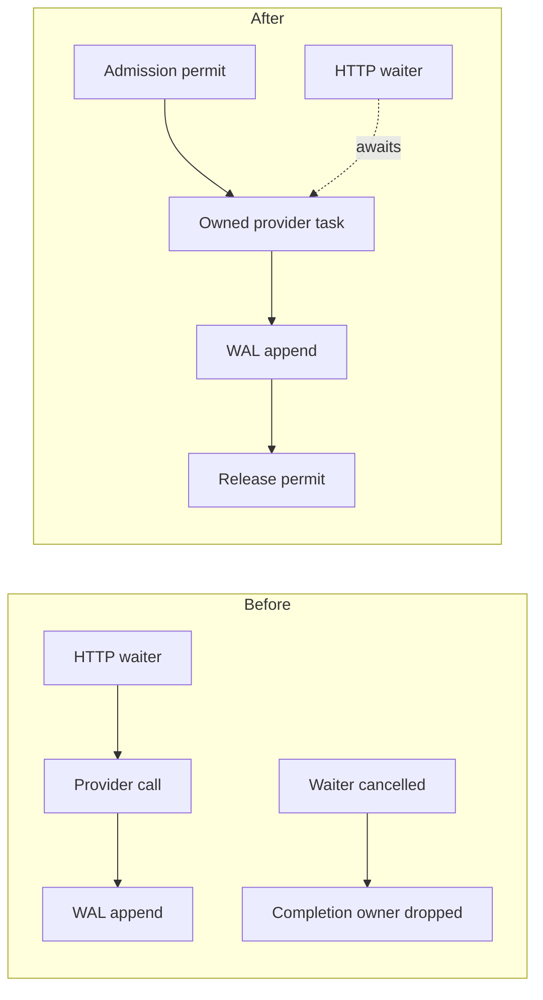

# Resources through completion

Accepted work keeps its resource owner until the work finishes. Replaceable
live work releases stale buffers as soon as a newer item replaces it.

| Path | Before | After |
|---|---|---|
| Recorded inference | A dropped HTTP waiter could drop the provider result before its WAL append. | The admitted task owns its permit and result through the append. A dropped waiter does not undo accepted work. |
| Parallel semantic chunks | Dropping the dispatcher could lose active completions. | Active calls retain their media and journal sender. Cancellation stops later chunks. A missing chunk does not discard completed later chunks. |
| Media subprocess | Some calls waited before draining pipes, retained unrestricted output, or left cleanup to an error path. | One helper drains both pipes, caps retained bytes, enforces a deadline, kills on failure, reaps the child and joins its readers. The frame limit also reaches ffmpeg. |
| Live decoded frames | A pending FIFO retained stale frames, and a producer could keep a drain loop running. | One pending frame retains the newest output. Each call drains at most 16 items and recycles replacements. Drop disconnects the reader before joining it. |
| JPEG encoding | A byte check after encoding allowed the temporary buffer to grow past its limit. | The encoder writer rejects output before it exceeds 2 MiB. Normal encoded bytes stay identical. |
| Sidecar exchange | Partial socket progress could restart a timeout. A failed embedding batch could strand queued callers. | One deadline covers framing, payload and response. A failed batch releases its bytes and wakes its callers; the worker continues. |
| Browser and SDK | A completed response header could end the timeout before the body. Replacement could leave a reader or late media callback alive. | Body reads share the request deadline. Stream exit cancels and releases its reader. Generation ownership closes late tracks and rejects stale callbacks. |

## Capacity and cost

The decoder pool covers 20 retained positions, including the old pending frame
and its replacement. Rounded YUV plane capacities reserve 30 MiB at 720p and
60 MiB at 1080p. These are source capacity calculations, not process RSS.
The previous 22-position allowance reserved 33 MiB and 66 MiB respectively
when using the same rounded plane sizes.

A local comparison called `decode_mp4_to_frame_signals` with 60 FPS sampling
and `max_frames = 3`. Both versions returned identical frame fields, including
PTS and hashes. Each arm used one warm-up and seven timed calls. Timing covered
the full function, including probing, both decode passes, parsing, subprocess
startup and cleanup.

| Synthetic input | Baseline median (range), ms | Current median (range), ms |
|---|---:|---:|
| One second, 60 frames | 57.531 (56.620–58.044) | 99.656 (89.289–115.367) |
| Thirty seconds, 1,800 frames | 233.592 (231.423–235.208) | 99.969 (99.111–100.619) |

Setup: baseline `442543456969326724f78dab132d50f5aea5331e`, Rust 1.89,
unoptimized dev profile, macOS 26.4 arm64, ffmpeg 8.1.1, 256×144 H.264 input.
The long input repeats the one-second fixture without re-encoding. The fixture
uses generated gray UI bars and a red block for four frames. No remote model
is involved. Arms ran sequentially on one host.

The frame limit avoids decoding the rest of the long input. The bounded helper
adds pipe-reader threads and a 20 ms child-status polling interval; short calls
cost more in this run. These dev-profile samples do not establish release
latency, service throughput or a workload-wide speedup. A production latency
budget remains unspecified.

## Remaining limits

The live ffmpeg path still couples synchronous input writes to bounded output
queues. No maximum output burst per input access unit is established. The
drain limit alone cannot prove that every input avoids a coupled-pipe stall.

Generation memory admission covers the declared video pools and workers. It
does not establish an aggregate process budget for every live audio track,
sidecar connection, allocator or codec allocation. Process boundaries do not
provide an OS security sandbox.

See [Runtime contracts](native-systems-profile.md) for source owners and
unresolved workload requirements.
